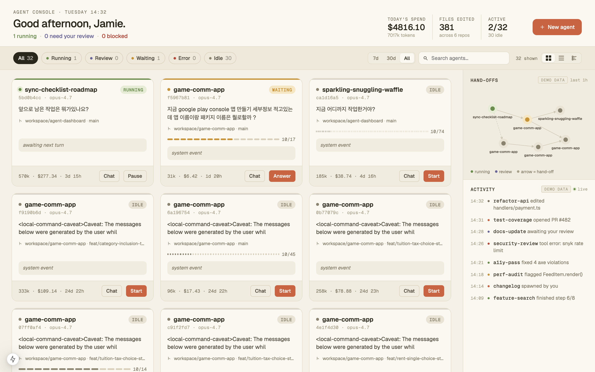

# Claude Code Session Dashboard

A local-only Next.js dashboard for **viewing** all your Claude Code (CLI) sessions in one screen — tokens, cost, status, file edits, recent activity.



## Honest limits

This is a **session-view tool**, not a live orchestration console. Claude Code currently exposes no IPC for `Pause` / `Approve` / etc., so:

- **The only real action is "spawn a new session"** — opens a new terminal and runs `claude` with deterministic args.
- The folder icon in the detail drawer opens the session's working directory in Finder/Explorer.
- All other action buttons (Pause / Stop / Approve / …) are **display-only** — clicking shows a toast explaining the limitation.
- Hand-offs graph + Activity feed in the sidebar are **demo data** (labeled `demo data`) until we can derive them from real `tool_use` events.

See [`docs/PRD.md`](docs/PRD.md) for the full scope decision.

## What it shows (real data)

Reads `~/.claude/projects/**/*.jsonl` and `~/.claude/sessions/*.json` to surface:

- One card per CLI session (`entrypoint === 'cli'` only — desktop/VSCode sessions excluded).
- **Status** (`running` / `waiting` / `idle` / `error`) inferred from PID liveness + last record type + age.
- **Tokens** = `input_tokens + output_tokens` summed across assistant messages (cache excluded).
- **Cost** = same sum + cache writes (1.25× input rate) + cache reads (0.10× input rate). *Long opus sessions can easily hit $50–$1000+ — that's real billing, not a bug.*
- **Files edited** = unique `file_path` from `Edit` / `Write` / `MultiEdit` / `NotebookEdit` content blocks.
- **Model** (short form `opus-4.7`, etc.), **repo** (last 2 cwd segments), **branch**, **started** (relative).

Auto-refresh every 30 s. Time-range toggle: `7d` (default) / `30d` / `All time`.

## Requirements

- macOS / Linux / Windows
- Node.js ≥ 20
- A populated `~/.claude/projects/` (i.e. you've used [Claude Code CLI](https://claude.com/claude-code) at least once)

## Install & run

```bash
npm install
npm run dev    # → http://127.0.0.1:3000
```

> The server binds **only** to `127.0.0.1` (loopback). `/api/spawn` and `/api/open-folder` additionally require an `Origin` header from `http://localhost:3000` or `http://127.0.0.1:3000` to prevent CSRF from other browser tabs ([ADR-015](docs/ADR.md)).

## Spawning a new session

Click **+ New agent**, fill in:

- **Agent name** — kebab-case, becomes `--name`.
- **Task / commission** — passed as the positional prompt.
- **Working directory** — absolute path. The new terminal `cd`s here before running `claude`.
- **Model** — one of opus / sonnet / haiku.

A UUID is generated client-side and passed as `--session-id`, so the optimistic placeholder card reconciles deterministically with the real `.jsonl` once it appears. If the session doesn't show up within 60 s the placeholder disappears with a toast.

## Commands

```bash
npm run dev       # dev server (port 3000, 127.0.0.1)
npm run build     # production build
npm run start     # production server (port 3000, 127.0.0.1)
npm run lint      # ESLint (Next.js core-web-vitals)
npm test          # vitest run (44 tests across lib + API)
```

## Architecture in 30 seconds

```
Browser (App)  ──fetch──►  /api/agents
        ▲                       │
        │ 30s poll              ▼
        │              scan ~/.claude/projects/**/*.jsonl
        │              + load ~/.claude/sessions/*.json
        │              (mtime cache → re-parse only on change)
        │
        ├──POST──►  /api/spawn       (Origin-checked)
        │              └─► child_process.spawn (new terminal)
        │
        └──POST──►  /api/open-folder (Origin-checked)
                       └─► open / xdg-open / start
```

Everything is local; no auth, no remote, no telemetry.

## Docs

| File | What's in it |
|------|-----|
| [`docs/PRD.md`](docs/PRD.md) | Why this exists + honest limits |
| [`docs/DATA_MODEL.md`](docs/DATA_MODEL.md) | JSONL → `Agent` mapping, status inference algorithm |
| [`docs/ADR.md`](docs/ADR.md) | Architectural decisions (entrypoint filter, polling, status v2, optimistic placeholders, local security) |
| [`docs/UI_GUIDE.md`](docs/UI_GUIDE.md) | Design tokens + anti-patterns |
| [`docs/COMPONENTS.md`](docs/COMPONENTS.md) | Component responsibilities + props |
| [`docs/TESTING.md`](docs/TESTING.md) | Test strategy (115-case plan; current implementation: 44 smoke tests) |
| [`docs/IMPLEMENTATION.md`](docs/IMPLEMENTATION.md) | Phase-by-phase progress |

## Tech stack

Next.js 15 (App Router) · React 18 · TypeScript strict · inline styles + CSS variables (no Tailwind) · Geist / Geist Mono / Instrument Serif via `next/font`.
